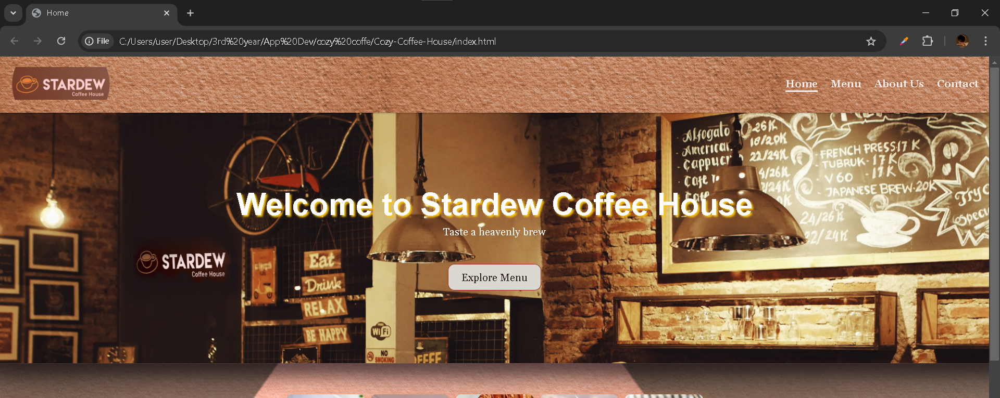
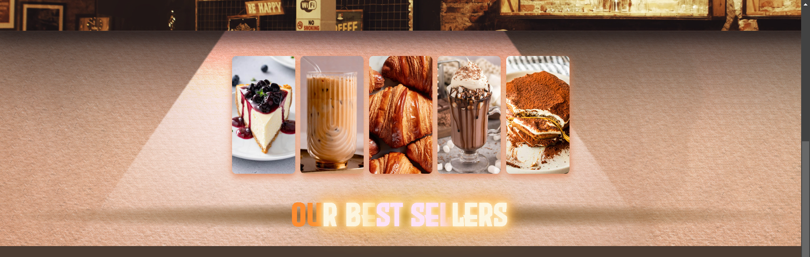
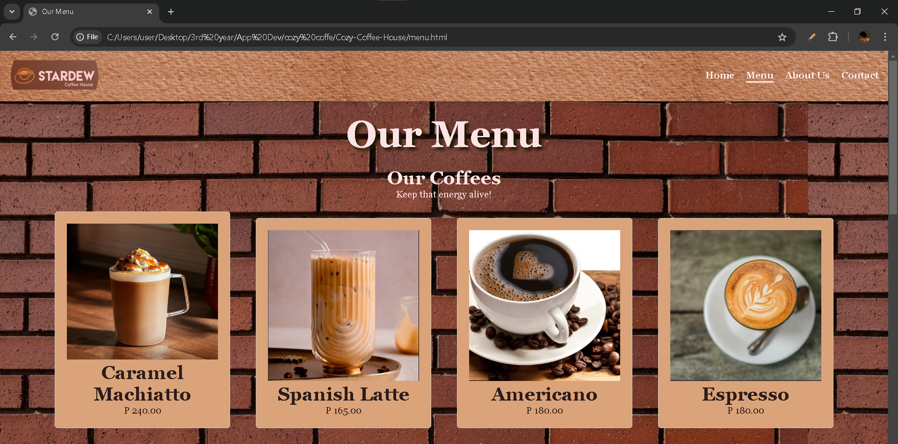
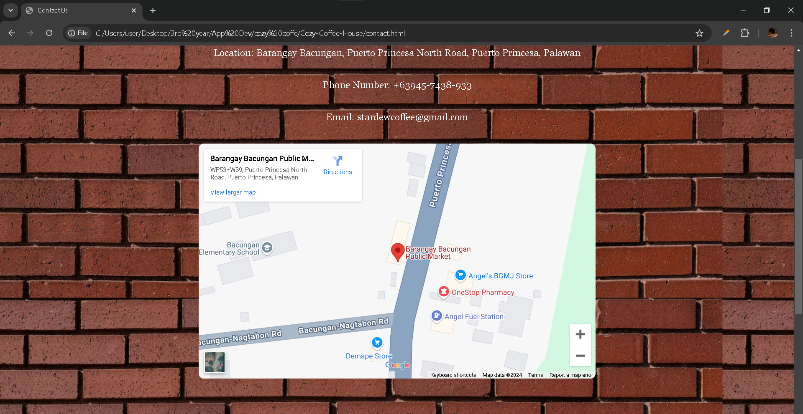
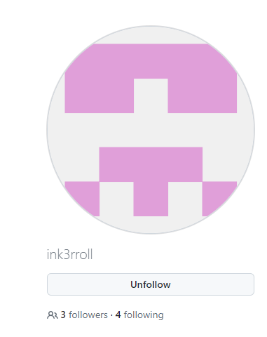
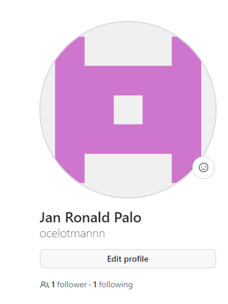

## Project Description
This project is a website for a local coffee house business, Stardew. 
It is a showcase of varrying menus containing popular coffee blends 
and pastries to pair up with it. The website also contains 
information about the owners of the coffee house, employees, 
and its contact details.

---

## Features
- Homepage that displays the best-selling products
- Menu page and its products
- About page filled with information about the business
- Contact page that displays the coffee house's address and contact details
- The newsletter forms
- Embedded google maps view of the Address

---

## Screen Captures

> The hero section showcases the interior of the coffee house.

---

> The featured section showcases the best-selling products offered.

---

> The menu page shows the products available.

---

> The address and its map on the contact page.-

---

## About the Authors

### **Erroll Jayke Montalvo**

> **ink3roll@gmail.com**

**Social Links**

> 

> 

### **Jan Ronald Palo**

> **ronaldkun999@gmail.com**

**Social Links**

> 

> 
